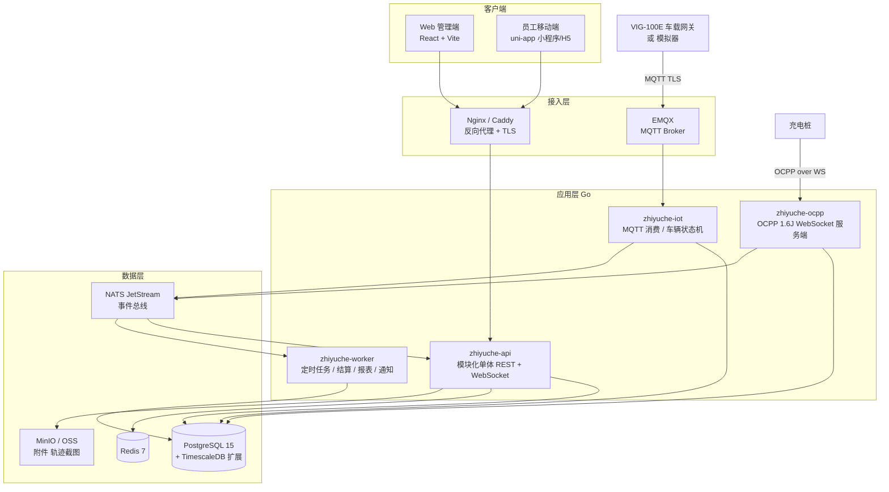

# 智御系统 V1 实现计划

> 依据：`docs/zhiyuche_v1_1.md`（技术方案 V1.1）+ 当前前端 Demo 代码
> 目标：在现有 React + Vite + Tailwind 架构基础上，把 Demo 演进为可交付的完整系统（前端 + 后端 + 系统管理）
> 日期：2026-09-09

---

## 1. 现状与目标

### 1.1 现状（Demo）

| 项 | 现状 |
|---|---|
| 技术栈 | React 18、Vite 5、Tailwind 3、Recharts、React Router 6、Lucide |
| 页面 | 总览 / 公务审批 / 行程管理 / 费用报表 / 车辆健康 / 充电管理，共 6 页 |
| 数据 | 全部来自 `src/data/mock.js` 静态数据，无接口、无登录、无权限 |
| 代码问题 | `main.tsx` / `App.tsx` / `vite.config.ts` 是脚手架残留，实际入口是 `main.jsx`；页面全是 `.jsx`，无类型；无状态管理、无请求层、无表单校验 |
| 部署 | Vercel 静态托管 |

### 1.2 V1 目标

在 V1.1 方案的三阶段路线中，本计划覆盖 **第一阶段全部 + 第二阶段软件部分**，硬件（VIG-100E）与 AI 模型训练不在本计划内，但预留接入点并提供模拟器。

V1 交付物：

1. **Web 管理端**：现有 6 个业务模块接真实接口，新增登录、系统管理、告警中心、账户与计费管理
2. **后端服务**：认证鉴权、系统管理、车辆资产、公务审批工作流、行程、计费与账户、充电（OCPP 服务端）、告警通知、IoT 接入、报表
3. **员工移动端**（uni-app）：用车申请、我的行程、扫码取还车、账户与充电记录
4. **基础设施**：Docker Compose 一键本地环境、CI、K3s 部署清单、数据库迁移脚本

---

## 2. 总体架构

### 2.1 架构原则

- **前端沿用现有架构**：不切换到 Ant Design Pro，继续 React + Vite + Tailwind，补齐 TypeScript、请求层、状态管理、表单与通用组件
- **后端"模块化单体"起步**：V1.1 方案规划的 10 个微服务在 6～20 辆车规模下过重。V1 用一个 Go 服务，按方案的服务边界划分内部模块（package），模块间只走接口不共享表，后期可按模块拆分为微服务
- **IoT 与充电走独立进程**：MQTT 接入（车端）和 OCPP 接入（桩端）是长连接、协议型服务，从一开始就独立为两个进程，与主 API 通过消息队列解耦
- **多租户从第一天设计**：所有业务表带 `tenant_id`，V1 单库单 schema + 行级过滤，SaaS 化时再切 schema 隔离

### 2.2 架构图



### 2.3 与 V1.1 方案的技术选型对照

| 项 | V1.1 方案 | V1 实施选择 | 说明 |
|---|---|---|---|
| Web 后台 | React + Ant Design Pro | **React + Vite + Tailwind（现有）** | 按现有架构，自建通用组件 |
| 移动端 | uni-app 三端 | uni-app（Vue 3 + TS） | 第 5 阶段实施 |
| 后端 | Go 微服务 ×10 | **Go 1.22 + Gin 模块化单体** | 边界与方案一致，延后拆分 |
| 工作流 | Camunda BPM | **自研状态机 + 审批链配置表** | 审批流固定为 1～2 级，Camunda 过重 |
| 主库 | PostgreSQL 15 | PostgreSQL 16 | 采用 timescale/timescaledb 官方镜像的 pg16 版本 |
| 时序库 | InfluxDB 2.0 | **TimescaleDB 扩展** | 少一套运维；轨迹/遥测存 hypertable，后期可迁 Influx |
| 消息队列 | Kafka | **NATS JetStream** | 单机足够、部署简单；接口抽象后可替换 Kafka |
| IoT 接入 | EMQX | EMQX 5 | 一致 |
| 充电协议 | OCPP 1.6/2.0 | OCPP 1.6J（JSON over WebSocket） | 先支持 1.6J，2.0.1 预留 |
| 缓存 | Redis 7 | Redis 7 | 一致 |
| 对象存储 | 阿里云 OSS | MinIO（本地）/ OSS（生产），S3 接口 | 一致 |
| 地图 | 高德 SDK | 高德 JS API 2.0 + Web 服务 API | 路线规划、轨迹回放、地理围栏 |
| 报表 | Python + Pandas | **Go 直接 SQL 聚合 + excelize 导出** | V1 报表规模小；AI 分析部分再引入 Python |
| 部署 | K3s | Docker Compose（开发）→ K3s（生产） | 一致 |

> 若团队以 JS/TS 为主、Go 经验不足，后端可等价替换为 NestJS + Prisma，模块划分与 API 契约不变。本计划以 Go 为基准。

---

## 3. 仓库结构（Monorepo）

```
zhiyuche/
├── apps/
│   ├── web/                 # 现有前端迁入（React + Vite + TS）
│   ├── mobile/              # uni-app 员工端（第 5 阶段）
│   └── api/                 # Go 后端
│       ├── cmd/
│       │   ├── api/         # REST + WebSocket 主服务
│       │   ├── iot/         # MQTT 消费 / 车辆状态机
│       │   ├── ocpp/        # OCPP 服务端
│       │   ├── worker/      # 定时任务
│       │   └── simulator/   # 车辆 + 充电桩模拟器（开发/演示用）
│       ├── internal/
│       │   ├── auth/        # 认证、JWT、RBAC
│       │   ├── system/      # 租户/部门/用户/角色/菜单/字典/参数/审计
│       │   ├── asset/       # 车辆/设备/NFC 卡/充电桩档案
│       │   ├── approval/    # 公务审批工作流
│       │   ├── trip/        # 行程、轨迹、行程事件
│       │   ├── billing/     # 计费规则引擎、账户、流水、结算
│       │   ├── charging/    # 充电事务、费用归集、交叉校验
│       │   ├── telemetry/   # 遥测入库、车辆实时状态
│       │   ├── alert/       # 告警规则与告警中心
│       │   ├── notify/      # 通知模板与多渠道推送
│       │   ├── health/      # 车辆健康、评分、维保工单、AI 报告
│       │   └── report/      # 报表聚合与导出
│       ├── pkg/             # 通用：db、cache、mq、logger、errors、pagination
│       ├── migrations/      # SQL 迁移（goose / atlas）
│       └── api/openapi.yaml # OpenAPI 3 契约，前端据此生成类型
├── packages/
│   └── shared/              # 前端共享：枚举、状态码、工具（web 与 mobile 共用）
├── deploy/
│   ├── docker-compose.yml   # PG + Redis + EMQX + NATS + MinIO + 各服务
│   ├── k3s/                 # 生产 manifests
│   └── nginx/
├── docs/
│   ├── zhiyuche_v1_1.md
│   ├── implementation_plan_v1.md   # 本文档
│   ├── api/                 # 接口文档（由 openapi 生成）
│   └── adr/                 # 架构决策记录
└── .github/workflows/       # CI：lint、test、build、镜像
```

现有 `src/` 迁入 `apps/web/src/`，Vercel 部署改为指向 `apps/web`（或改为与后端一起部署）。

---

## 4. 数据模型

按 V1.1 方案的 ER 图扩展，补齐系统管理和计费账户。所有业务表统一字段：`id uuid`、`tenant_id`、`created_at`、`updated_at`、`deleted_at`（软删）、`created_by`。

### 4.1 系统管理域

| 表 | 关键字段 | 说明 |
|---|---|---|
| `tenants` | name, code, license_no, status, expires_at | 租户 |
| `departments` | tenant_id, parent_id, name, path, leader_user_id, monthly_budget | 树形部门，leader 为一级审批人 |
| `users` | tenant_id, dept_id, username, phone, password_hash, name, status, employee_no, wx_openid | 员工即用户 |
| `roles` | tenant_id, code, name, is_system | 内置：超级管理员、租户管理员、车队管理员、审批人、财务、员工 |
| `permissions` | code, name, type(menu/button/api), parent_id, path, sort | 权限点，全局定义 |
| `role_permissions` / `user_roles` | | 关联 |
| `dict_types` / `dict_items` | type_code, label, value, sort, color | 车辆状态、用车事由、告警类型等 |
| `sys_params` | tenant_id, key, value, description | 如超时告警阈值、低电锁定 SOC |
| `audit_logs` | tenant_id, user_id, action, module, target_id, before, after, ip, ua | 全操作留痕，只写不删 |
| `notification_templates` | code, channel, title, content | 微信订阅消息 / 短信 / 站内信 |

### 4.2 车辆资产域

| 表 | 关键字段 |
|---|---|
| `vehicles` | plate_no, vin, model, brand, color, status, odometer, soc, soh, range_km, seat_count, purchase_date, insurance_expire, inspection_expire, device_id, home_dept_id |
| `devices` | serial_no(VIG 网关号), vehicle_id, firmware, iccid, last_online_at, cert_fingerprint |
| `nfc_cards` | card_uid, user_id, status, issued_at |
| `charge_piles` | pile_code(OCPP identity), name, type(快/慢), power_kw, connector_count, location, status, last_heartbeat_at |

### 4.3 审批与行程域

| 表 | 关键字段 |
|---|---|
| `approvals` | apply_no, applicant_id, dept_id, trip_type(公务/日常), purpose_code, purpose_detail, planned_start, planned_end, destination, dest_lnglat, planned_route(jsonb), planned_km, passengers(jsonb), attachments(jsonb), vehicle_id, status, current_step, urgency |
| `approval_steps` | approval_id, step_no, approver_id, action(pending/approved/rejected), remark, acted_at, ip |
| `approval_rules` | tenant_id, condition(jsonb: 跨部门/夜间/里程>X), require_level2, level2_approver_role |
| `trips` | trip_no, vehicle_id, driver_id, card_id, approval_id, trip_type, start_at, end_at, start_odometer, end_odometer, distance_km, energy_kwh, start_soc, end_soc, avg_speed, max_speed, harsh_accel, harsh_brake, roof_sign_status, cost, cost_detail(jsonb), status, deviation_flag |
| `trip_points` (hypertable) | trip_id, vehicle_id, ts, lng, lat, speed, heading, soc | 轨迹点 |
| `trip_events` | trip_id, type(start/end/deviation/overspeed/low_soc/sign_off), ts, payload |

### 4.4 计费与账户域

| 表 | 关键字段 |
|---|---|
| `billing_rules` | tenant_id, name, rule(jsonb，格式即方案 §2 的 JSON), effective_from, effective_to, is_default |
| `accounts` | tenant_id, level(enterprise/department/employee), owner_id, balance, credit_limit, monthly_budget, status |
| `account_transactions` | account_id, type(recharge/trip/charge/penalty/refund/adjust), amount, balance_after, ref_type, ref_id, remark |
| `settlements` | tenant_id, period(YYYY-MM), dept_id, trip_cost, charge_cost, penalty, total, status, pdf_url |

### 4.5 充电与遥测域

| 表 | 关键字段 |
|---|---|
| `charge_transactions` | pile_id, connector_id, ocpp_tx_id, id_tag, vehicle_id, user_id, start_at, end_at, meter_start, meter_stop, kwh, cost, bms_soc_start, bms_soc_end, bms_kwh_est, deviation_pct, review_status |
| `charge_meter_values` (hypertable) | tx_id, ts, kwh, voltage, current, power |
| `vehicle_telemetry` (hypertable) | vehicle_id, ts, lng, lat, speed, soc, soh, cell_temp, motor_temp, acc_on, locked, sign_on |
| `vehicle_status` | vehicle_id, status, current_trip_id, lng, lat, soc, updated_at | 当前状态快照，Redis 同步 |

### 4.6 健康与告警域

| 表 | 关键字段 |
|---|---|
| `health_snapshots` | vehicle_id, period, soh, score, energy_per_100km, fast_charge_count, harsh_accel, harsh_brake, issues(jsonb), ai_report(text), level |
| `driver_scores` | user_id, period, score, detail(jsonb), level |
| `maintenance_orders` | vehicle_id, type, source(manual/ai/mileage), status, planned_date, done_date, cost, vendor, ai_diagnosis |
| `alert_rules` | tenant_id, type, threshold(jsonb), notify_roles, enabled |
| `alerts` | tenant_id, type, level, vehicle_id, trip_id, user_id, title, content, status(open/ack/closed), acked_by, acked_at |

---

## 5. 后端模块与接口清单

统一约定：`/api/v1` 前缀；JWT Bearer；响应 `{code, message, data}`；列表接口统一 `page/pageSize/sort/filter`；所有写操作写 `audit_logs`。

| 模块 | 主要接口 | 说明 |
|---|---|---|
| auth | `POST /auth/login`、`/auth/refresh`、`/auth/logout`、`GET /auth/me`、`GET /auth/menus`、`POST /auth/wx-login` | 账号密码 + 微信小程序登录；`/me` 返回权限码集合，前端按码控制菜单与按钮 |
| system/tenants | CRUD `/system/tenants` | 仅超级管理员 |
| system/depts | CRUD `/system/depts`，`GET /system/depts/tree` | 树形 |
| system/users | CRUD `/system/users`，`/users/{id}/reset-password`，`/users/{id}/roles`，`/users/import` | 支持 Excel 导入员工 |
| system/roles | CRUD `/system/roles`，`/roles/{id}/permissions` | |
| system/permissions | `GET /system/permissions/tree` | 代码定义、seed 入库 |
| system/dicts | CRUD `/system/dict-types`、`/system/dict-items` | |
| system/params | `GET/PUT /system/params` | |
| system/audit | `GET /system/audit-logs` | 只读 |
| asset/vehicles | CRUD `/vehicles`，`GET /vehicles/{id}/status`，`/vehicles/{id}/telemetry?from&to`，`POST /vehicles/{id}/commands`(lock/unlock/sign_on/sign_off) | 命令下发经 NATS → iot 服务 → MQTT |
| asset/devices | CRUD `/devices`，`/devices/{id}/bind` | 网关与车辆绑定 |
| asset/cards | CRUD `/nfc-cards`，`/nfc-cards/{id}/bind`，`/loss` | |
| asset/piles | CRUD `/charge-piles`，`GET /charge-piles/{id}/live` | |
| approval | `POST /approvals`（含预检）、`GET /approvals`、`GET /approvals/{id}`、`POST /approvals/{id}/approve|reject|cancel`、`GET /approvals/todo`、`GET /approvals/available-vehicles?start&end` | 状态机：draft→pending_l1→pending_l2→approved→in_use→completed / rejected / cancelled |
| trip | `GET /trips`、`GET /trips/{id}`、`GET /trips/{id}/track`、`POST /trips/start`（NFC/扫码取车）、`POST /trips/{id}/end`、`POST /trips/{id}/appeal`、`GET /trips/{id}/report.pdf` | 行程由取车动作创建，遥测自动累计 |
| billing | CRUD `/billing/rules`，`POST /billing/rules/{id}/simulate`，`GET /accounts`，`POST /accounts/{id}/recharge|adjust`，`GET /accounts/{id}/transactions`，`GET /settlements`，`POST /settlements/generate?period` | 规则引擎按方案 JSON 结构，支持热加载 |
| charging | `GET /charge-transactions`，`GET /charge-transactions/{id}`，`POST /charge-transactions/{id}/review`，`POST /charge-piles/{id}/remote-start|stop` | 交叉校验偏差 >5% 进入人工复核 |
| alert | `GET /alerts`，`POST /alerts/{id}/ack|close`，CRUD `/alert-rules` | |
| notify | `GET /notifications`，`PUT /notifications/read`，CRUD `/notification-templates` | 渠道：站内信（V1 必做）、微信订阅消息、短信（对接阿里云） |
| health | `GET /health/vehicles`，`GET /health/vehicles/{id}`，`POST /health/vehicles/{id}/report`（触发 LLM 生成）、`GET /health/drivers`、CRUD `/maintenance-orders` | V1 评分为规则版，模型版预留接口 |
| report | `GET /reports/overview`，`/reports/dept?period`，`/reports/employee`，`/reports/vehicle`，`/reports/charging`，`/reports/export?type&format=xlsx|pdf` | |
| ws | `GET /ws?token=`（WebSocket） | 推送：车辆状态、新告警、审批待办、充电进度 |
| iot（内部） | MQTT 主题：`vig/{sn}/telemetry`、`vig/{sn}/event`、`vig/{sn}/cmd`、`vig/{sn}/cmd_ack` | 协议 JSON，参考 GB/T 32960 字段 |
| ocpp（内部） | `ws://host/ocpp/{pileCode}` | BootNotification、Heartbeat、StatusNotification、Authorize、StartTransaction、MeterValues、StopTransaction、RemoteStart/StopTransaction |

---

## 6. 前端改造与新增

### 6.1 工程改造

1. 删除脚手架残留：`App.tsx`、`App.css`、`main.tsx`、`vite.config.ts`，保留 `main.jsx` 路径的路由入口并改为 TS
2. 全面 TypeScript：页面与组件改 `.tsx`，`tailwind.config.js` content 补 `ts,tsx`
3. 新增依赖：`axios`、`@tanstack/react-query`（服务端状态）、`zustand`（登录态/全局 UI 状态）、`react-hook-form` + `zod`（表单）、`dayjs`、`@amap/amap-jsapi-loader`、`xlsx`（前端导出兜底）
4. 由 `openapi.yaml` 生成 `src/api/types.ts`（openapi-typescript），请求函数手写在 `src/api/*.ts`
5. 环境变量：`VITE_API_BASE`、`VITE_AMAP_KEY`、`VITE_WS_URL`

### 6.2 目录

```
apps/web/src/
├── api/            # 按模块的请求函数 + 生成类型
├── components/
│   ├── ui/         # Button Input Select Modal Drawer Table Pagination Tabs Badge Empty Toast Confirm
│   ├── form/       # FormField、DateRange、DeptTreeSelect、UserSelect、VehicleSelect、MapPicker、Upload
│   ├── layout/     # Layout(现有) + 动态菜单 + 面包屑 + 通知铃铛
│   └── map/        # AMap 封装：VehicleMap、TrackPlayer、RoutePreview
├── hooks/          # useAuth、usePermission、useWebSocket、useTable(分页+筛选统一)
├── store/          # auth、ui
├── router/         # 路由表 + 权限守卫 + 懒加载
├── pages/
│   ├── auth/       Login
│   ├── dashboard/  总览（恢复实时车辆地图）
│   ├── approval/   列表、详情、新建申请、审批规则
│   ├── trips/      列表、详情（轨迹回放）、申诉处理
│   ├── charging/   桩实时状态、充电记录、人工复核
│   ├── health/     健康列表、车辆详情、AI 报告、维保工单、驾驶员评分
│   ├── reports/    总览、部门、员工、车辆、充电、导出
│   ├── billing/    计费规则、账户、流水、月度结算
│   ├── alerts/     告警中心、告警规则
│   └── system/     用户、部门、角色、菜单权限、字典、参数、审计日志、
│                   车辆档案、网关设备、NFC 卡、充电桩档案、通知模板、租户
└── utils/
```

### 6.3 页面清单（新增部分）

| 分组 | 页面 | 权限码 |
|---|---|---|
| 认证 | 登录、修改密码 | — |
| 系统管理 | 用户管理、部门管理、角色管理、菜单与权限、字典管理、参数设置、审计日志、通知模板、租户管理 | `system:*` |
| 资产管理 | 车辆档案、网关设备、NFC 卡、充电桩档案 | `asset:*` |
| 计费账户 | 计费规则、账户管理、交易流水、月度结算 | `billing:*` |
| 告警中心 | 告警列表、告警规则 | `alert:*` |
| 审批 | 新建申请（Web 端也可发起）、审批规则 | `approval:*` |
| 健康 | 维保工单、驾驶员评分 | `health:*` |

现有 6 个页面保留 UI 风格，改为接口数据 + 分页筛选 + 详情抽屉。

---

## 7. 分阶段实施计划

按 2～3 名开发（前端 1、后端 1～2）估算，共约 **20 周**。每阶段末有可演示的增量。

### 阶段 0：工程基线（第 1 周）

- Monorepo 目录搭建，前端迁入 `apps/web`，清理残留文件，改 TS
- Go 项目骨架：配置、日志、DB、迁移、统一响应与错误、中间件（recover/cors/requestid/auth/audit）
- `docker-compose.yml`：PostgreSQL+Timescale、Redis、EMQX、NATS、MinIO
- CI：前端 lint/build，后端 vet/test/build，镜像构建
- OpenAPI 契约文件初始化，前端类型生成脚本

**产出**：`docker compose up` 起全套环境，前端能调后端 `/health`。

**开发环境约定（2026-09-09 确定）**：本机（Windows）只写代码，不装 Go/Docker；编译、测试、运行在远程机器 `devtest`（100.95.76.81，目录 `/home/xintong/zuche`）。该机器为共享环境，本项目固定使用 20000–20999 端口段，GitHub 仅 SSH 可达，Go 模块走 goproxy.cn，npm 走 npmmirror，Docker 镜像走 docker.m.daocloud.io。同步与远程执行脚本见 `scripts/`，端口表见根 README。

### 阶段 1：认证与系统管理（第 2～5 周）

后端：租户、部门树、用户、角色、权限、菜单、字典、参数、审计日志、通知模板；JWT 登录、刷新、RBAC 中间件；权限 seed；Excel 导入员工。
前端：登录页；Layout 改动态菜单；通用组件库（表格/表单/弹窗/抽屉/分页/树选择）；系统管理全部页面；按钮级权限。

**产出**：多角色登录，系统管理闭环，审计留痕。

**完成情况（2026-09-09）**：已交付。后端 60 余个接口（认证、用户、部门、角色权限、租户、字典、参数、审计查询、通知模板、用户 Excel 导入导出），前端登录、动态菜单布局、组件库（Button/Table/Drawer/Tree/CheckTree/Form 等 30 个）与 9 个系统管理页面，超级管理员可切换查看租户。验证：Go 单测 12 个包，端到端脚本 `apps/api/scripts/verify-be1.sh`（166 项）、`verify-be2.sh`（169 项）、`apps/web/scripts/verify-fe2.sh`（115 项）全部通过；CI 绿。未做：浏览器级 UI 测试（远程无浏览器，待实机验收）；租户到期时间只存储不校验。引导账号：`admin/Admin@123456`（平台）、`chenhua_admin/Admin@123456`（演示租户），首次登录后请修改。

### 阶段 2：车辆资产、审批与行程（第 6～9 周）

后端：车辆/设备/NFC 卡/充电桩档案；审批状态机（预检：车辆时段冲突、账户余额、审批规则判定是否二级）；行程创建/结束（先支持 Web 与模拟器触发）；轨迹存储与查询；站内信通知；WebSocket 推送。
前端：资产管理页面；审批列表/详情/新建（地图选点 + 高德路线规划 + 预计里程）；行程列表/详情/轨迹回放；总览恢复实时车辆地图。
模拟器：`cmd/simulator` 生成车辆遥测与行程，供演示与联调。

**产出**：完整"申请→审批→取车→行驶→还车→行程归档"闭环（数据来自模拟器）。

**完成情况（2026-09-09）**：已交付。后端：车辆/网关设备/NFC 卡/充电桩档案，车辆实时状态与遥测（TimescaleDB），设备鉴权上报接口，审批工作流（预检、一二级审批人自动确定、规则、状态机、过期懒标记），行程开始/结束/作废（设备侧钩子、轨迹入库、超速/低电/偏离/灯牌事件、里程能耗急加减速汇总、xlsx 导出），总览接口，站内通知，WebSocket 推送；`cmd/simulator` 模拟器可自动建资产并按"申请→审批→刷卡取车→行驶→还车→充电"循环。前端：地图组件（高德 / 无 Key 自绘示意图）、WebSocket 与通知铃、资产四页、真实数据总览、审批列表/详情/发起（预检）/规则、行程列表/详情/轨迹回放。验证：后端脚本 `verify-be-a.sh`（194 项）、`verify-be-b.sh`（166 项），主库上模拟器 2 分钟产生 18 次设备行程；前端 typecheck/lint/build 零错误；CI 绿。未做：定时任务（超时未还提醒、过期标记改定时）留阶段 4；附件上传（当前只登记 URL）；GCJ-02 坐标转换；浏览器级 UI 验收。演示数据：主库运行模拟器即可产生，驾驶员账号 `sim_driver_1..3 / Sim@123456`。

### 阶段 3：计费、账户与充电（第 10～13 周）

后端：计费规则引擎（方案 JSON 结构：里程/时长/日封顶/时段倍率/低电附加/违规罚金）、规则模拟计算接口、三级账户与流水、行程结束自动扣费、月度结算单生成与 PDF；OCPP 1.6J 服务端（Boot/Heartbeat/Status/Authorize/Start/Meter/Stop/RemoteStart/Stop）、充电事务与车辆员工绑定、桩侧 kWh 与 BMS SOC 增量交叉校验、充电费归集。
前端：计费规则（JSON 可视化编辑 + 模拟器）、账户/流水/充值、结算单；充电管理接实时数据、充电记录、人工复核。
模拟器扩展：OCPP 桩模拟。

**产出**：费用自动计算与扣费，充电费归属到部门/员工，结算单可导出。

### 阶段 4：IoT 接入、告警与健康（第 14～17 周）

后端：EMQX 接入（设备证书认证、ACL）、MQTT 协议解析入库、车辆状态机（空闲/预约/在途/充电/维保/离线）、命令下发与回执（解锁/锁车/灯牌开关）；告警规则引擎（路线偏离、超时未还、超速、深夜用车、低电、灯牌异常、电池温度）、告警中心、通知分级升级；健康快照定时计算（SOH 分级、规则版驾驶评分、能耗对比）、维保工单、里程保养提醒、LLM 报告生成（Claude/Qwen API，提示词模板化）。
前端：告警中心与规则；健康模块接真实数据、AI 报告、维保工单、驾驶员评分。
Worker：日/月定时任务（评分、快照、结算、超时检测）。

**产出**：真实网关（或模拟器）接入后全链路自动运行，告警实时推送。

### 阶段 5：移动端、报表完善与上线（第 18～20 周）

- uni-app 员工端：登录（微信授权）、首页、申请用车、扫码取还车、我的行程与详情、账户与充电记录、审批（H5 审批人）
- 报表：部门/员工/车辆/充电多维报表，Excel/PDF 导出，月报推送
- 多租户加固：数据隔离测试、租户开通流程
- 安全：限流、密码策略、敏感操作二次确认、审计不可删、HTTPS、MQTT TLS 双向认证
- 测试：后端单元 + 集成（testcontainers），前端关键流程 e2e（Playwright），压测（遥测写入）
- 部署：K3s manifests、备份策略、监控（Prometheus + Grafana）、日志（Loki）
- 文档：部署手册、操作手册、接口文档、ADR

**产出**：可交付 V1。

---

## 8. 关键设计要点

1. **审批状态机**：状态与迁移集中在 `approval/state.go`，每次迁移写 `approval_steps` 并发事件；二级审批触发条件从 `approval_rules` 读取，租户可配。
2. **计费规则热加载**：规则存库，Redis 缓存，变更发 NATS 事件各实例刷新；计算过程输出明细 `cost_detail`，行程结算单据此渲染。
3. **行程与遥测**：遥测按车辆入 hypertable；行程期间的点按 `trip_id` 关联；行程结束时聚合里程、能耗、急加减速；路线偏离用高德路线折线与轨迹点距离计算（>1 km 触发）。
4. **充电归属**：`id_tag`（卡号/用户）+ 时间窗口 + 桩位置与车辆位置匹配三重绑定；无法确定时进入待复核。
5. **命令下发可靠性**：命令表记录状态（pending/sent/acked/timeout），超时重发，灯牌异常自动重发并告警。
6. **权限模型**：权限码三级（模块:资源:操作），后端路由注册时声明权限码，前端按 `/auth/me` 返回的码集合控制菜单和按钮。
7. **多租户**：GORM/sqlc 层统一注入 `tenant_id` 过滤，超级管理员跨租户操作显式传参。
8. **审计**：中间件在写操作后异步记录 before/after，审计表无更新删除接口。

---

## 9. 非功能要求

| 项 | 要求 |
|---|---|
| 性能 | 20 辆车 10 秒/条遥测（约 2 条/秒）为基线，设计支撑 1000 辆（100 条/秒）；列表接口 P95 < 300 ms |
| 可用性 | 单机部署，数据库每日备份，服务崩溃自动重启 |
| 安全 | 密码 bcrypt；JWT 15 分钟 + refresh 7 天；接口限流；设备 X.509 证书；SQL 参数化；上传文件类型白名单 |
| 可观测 | 结构化日志（zerolog）、请求追踪 ID、Prometheus 指标、健康检查端点 |
| 测试 | 后端核心模块（计费、审批状态机、充电校验）单测覆盖 ≥ 80%；关键流程 e2e |
| 兼容 | Web 端 Chrome/Edge 最近 2 个版本；小程序基础库 ≥ 2.20 |

---

## 10. 风险与待定事项

| 风险 / 待定 | 影响 | 应对 |
|---|---|---|
| VIG-100E 硬件进度与协议未定 | 阶段 4 无法真机联调 | 阶段 2 起用模拟器；先按 GB/T 32960 字段定义 MQTT 协议，硬件按协议对接 |
| 充电桩厂商 OCPP 实现差异 | 部分桩无法接入 | 选定 1～2 个桩型先验证；提供桩兼容性清单 |
| 高德 API 商用授权 | 地图与路线规划功能 | 申请企业 Key，评估费用；轨迹回放前端自绘不依赖付费接口 |
| 微信小程序资质 | 移动端上线 | 提前注册企业主体小程序，申请蓝牙/订阅消息权限 |
| LLM 报告调用 | 成本与稳定性 | 报告按月生成而非实时；失败降级为规则模板报告 |
| 与上级公务平台对接（方案 §7.3） | 接口规范未知 | 本计划仅预留 OpenAPI + Webhook 接口框架，具体对接待规范明确后立项 |
| 后端语言选择 | 团队技能匹配 | 阶段 0 前确认 Go 或 NestJS |

---

## 11. 下一步

1. 确认后端语言（Go / NestJS）与团队分工
2. 确认 V1 是否包含移动端（阶段 5），或先以 Web 移动适配替代
3. 启动阶段 0：工程基线搭建
