# 智御车辆智能租赁与全生命周期管理系统
## 完整技术方案 V1.1

> 版本 v1.1 | 面向工业园区 B2B 场景的自主可控、可专利化技术方案
> 适用车型：**纯电动汽车**，配套充电桩一体化管理

### v1.1 修订说明

| 修订项 | 修订内容 |
|-------|--------|
| 硬件路线 | VIG-100E 明确采用**分时租赁 T-BOX 成熟技术路线**，功能基线对标速锐得、迈易（移动管家）、树根互联等业内成熟产品，全部**完全自主开发** |
| 充电架构 | 按业内通行做法改为**充电桩直连平台上报充电事务**（OCPP 桩→云），车端网关不再内置 OCPP 客户端，仅做 BMS SOC 交叉校验 |
| 移动端 | 采用 **uni-app 三端适配技术**（微信小程序 / H5 / Web 一码三端），**不单独开发原生 App** |

---

## 目录

1. [项目概述与目标](#一项目概述与目标)
2. [四大核心技术突破](#二四大核心技术突破)
   - 2.1 软硬件一体化：自研轻量级车载智能网关
   - 2.2 微服务多租户 SaaS 平台架构
   - 2.3 AI 全生命周期车辆管养（纯电动专项）
   - 2.4 工业园区场景深度融合
3. [系统整体架构](#三系统整体架构)
4. [硬件方案详细设计](#四硬件方案详细设计)
5. [软件平台详细设计](#五软件平台详细设计)
6. [数据与 AI 层设计](#六数据与-ai-层设计)
7. [公务用车管理与审批平台](#七公务用车管理与审批平台)
8. [轻应用平台设计（三端适配，不单独开发 App）](#八轻应用平台设计三端适配不单独开发-app)
9. [安全与合规设计](#九安全与合规设计)
10. [知识产权保护策略](#十知识产权保护策略)
11. [实施路线图](#十一实施路线图)
12. [技术选型汇总](#十二技术选型汇总)

---

## 一、项目概述与目标

### 背景

**智御车辆智能租赁与全生命周期管理系统**（以下简称"智御系统"）面向工业园区、企事业单位等 B2B 场景，以 **6 辆纯电动汽车车队**为起点，构建一套自主可控、具备专利壁垒的智慧车队管理平台。

车队全部采用纯电动汽车，配套园区充电桩，实现零碳出行、绿色运营。系统不仅覆盖基础的计费与调度，更以**公务用车规范化管理**和**AI 全生命周期管养**为核心差异化优势。

### 当前痛点

| 痛点类别 | 具体问题 |
|---------|--------|
| 计费管控 | 无刷卡计费手段，依靠人工登记，误差大、易扯皮 |
| 能源管理 | 电动车充电无序，桩位占用、充电费用无法归属个人/部门 |
| 公务合规 | 公务用车无审批流程，事由不明、轨迹无留痕，合规风险高 |
| 车辆健康 | 电动车电池健康、续航焦虑无预警，维修被动响应 |
| 数据孤岛 | 车辆、充电、审批、财务各系统割裂，无法统一分析 |

### 核心目标

| 目标维度 | 具体指标 |
|--------|--------|
| 计费准确率 | ≥ 99.5%，含充电费用归集 |
| 公务合规率 | 用车审批 100% 线上留痕，0 违规用车 |
| 能源管理 | 充电成本精确到部门/员工，降低公车私用 |
| 车辆可用率 | 非计划停车率下降 ≥ 40% |
| 管理效率 | 人工对账时间减少 ≥ 80% |
| 知识产权 | 申请 ≥ 2 项发明专利 + 1 项软件著作权 |
| 可复制性 | 6 个月内具备向第三方客户交付的 SaaS 能力 |

---

## 二、四大核心技术突破

### 突破一：软硬件一体化——自研轻量级车载智能网关（VIG-100E 纯电版）

#### 核心设计理念

VIG-100E 采用**分时租赁 T-BOX 成熟技术路线**：功能基线对标业内成熟产品（速锐得 E6/E6S 新能源分时租赁 T-BOX、迈易科技"移动管家"车联网 T-BOX、树根互联根云移动物联终端），硬件电路、嵌入式固件、通信协议栈**完全自主开发**，不采购第三方整机或授权固件，确保自主可控与专利归属清晰。设计遵循 GB/T 32960《电动汽车远程服务与管理系统技术规范》。

针对纯电动汽车特性，VIG-100E 在通用 OBD 基础上深度接入**电动车专有 CAN 协议**（BMS 电池管理系统、电机控制器），并集成**车顶智能灯牌控制模块**，专为公务用车场景设计。

**竞品对标与自研边界：**

| 对标厂商/产品 | 借鉴的成熟做法（行业验证过的路线） | 智御完全自研的差异点 |
|------------|--------------------------|-----------------|
| 速锐得 E6/E6S（新能源分时租赁 T-BOX）| 免破线安装、EV CAN 采集、蓝牙虚拟钥匙 | 车顶公务灯牌联动、离线边缘计费引擎 |
| 迈易/移动管家 T-BOX | 远程控车、实时监控上传、多场景终端形态 | NFC+蓝牙+人脸多因子控车一体化 |
| 树根互联 根云 T-BOX | 模块化硬件设计、低功耗与流量压缩、端到端数据链路 | 面向园区公务场景的审批状态机与计费规则热加载 |

> 对标仅用于确立功能与可靠性基线、降低工程试错成本；全部软硬件由本项目团队自主设计开发，形成独立知识产权。

#### 硬件功能模块

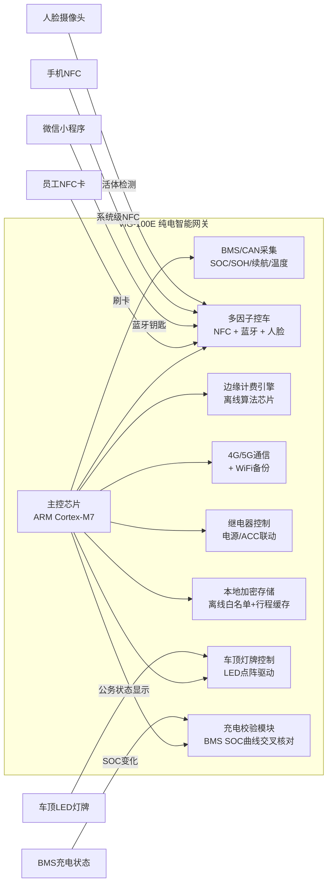

#### 纯电动专项数据采集

| 数据类别 | 具体指标 | 采样频率 | 用途 |
|---------|--------|--------|-----|
| 电池状态 | SOC（剩余电量%）、SOH（电池健康度）、电芯温度 | 30秒/次 | 续航预测、电池预警 |
| 充电数据 | 充电起止时间、充电量（kWh）、充电桩ID | 每次充电 | 充电费用归集 |
| 能耗数据 | 百公里能耗（kWh/100km）、回收能量 | 每次行程 | 驾驶效率评分 |
| 电机状态 | 电机温度、转矩输出 | 10秒/次 | 故障预警 |
| 续航估算 | 当前剩余续航里程（BMS原生数据）| 60秒/次 | 调度决策 |

#### 车顶智能灯牌模块

公务用车时，系统远程或本地触发车顶 LED 点阵灯牌，显示"**公务用车**"字样，行程结束后自动熄灭。

```
灯牌控制逻辑：
1. 审批通过 + 刷卡启动 → 自动亮灯"公务用车"
2. 行程结束（刷卡还车 or 小程序结束）→ 自动熄灭
3. 平台管理员可远程强制开/关灯牌
4. 异常行驶（绕路/超时未还车）→ 灯牌闪烁告警
```

#### 充电桩联动计费（桩直连平台架构）

按业内通行做法，充电桩作为 OCPP 客户端**直连智御平台**上报充电事务（StartTransaction / MeterValues / StopTransaction），车端网关**不参与桩通信、不内置 OCPP 客户端**。VIG-100E 仅上报 BMS SOC 变化曲线，平台将桩侧计量与车端 SOC 增量**交叉校验**，并通过"鉴权ID + 时间窗口 + 位置匹配"完成充电事务与车辆/员工的归属绑定。该架构兼容主流桩厂，无需对桩做任何改造。

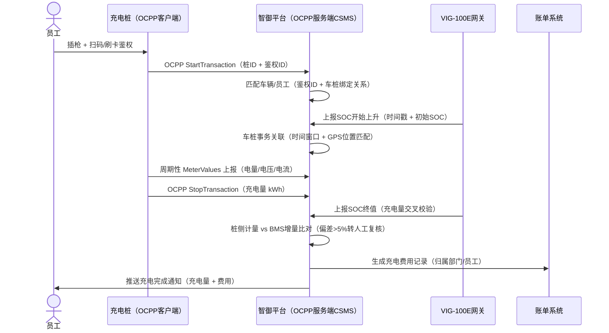

**专利申请方向：**《一种工业园区离线状态下纯电动车辆安全控车与计费的物联网系统及方法》（发明专利）

---

### 突破二：微服务多租户 SaaS 平台架构

#### 整体架构

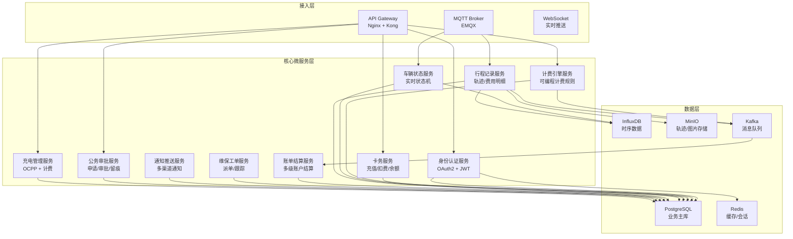

#### 可编程计费引擎（纯电动增强版）

在原有里程+时间计费基础上，增加**电费归集**模块：

```json
{
  "rule_name": "纯电车队标准套餐",
  "base_rate": {
    "per_km": 0.60,
    "per_hour": 5.00,
    "daily_cap": 80.00
  },
  "ev_specific": {
    "electricity_cost_per_kwh": 0.65,
    "charging_attribution": "employee",
    "low_battery_surcharge": {
      "threshold_soc": 20,
      "surcharge_pct": 10
    }
  },
  "time_multipliers": [
    { "name": "早高峰", "range": "07:30-09:00", "factor": 1.3 },
    { "name": "晚高峰", "range": "17:30-19:00", "factor": 1.3 },
    { "name": "深夜", "range": "23:00-06:00", "factor": 0.7 }
  ],
  "penalty_rules": [
    { "type": "overspeed", "threshold_kmh": 80, "fine_per_event": 5.0 },
    { "type": "not_charging_on_return", "min_soc_required": 30, "fine": 10.0 }
  ],
  "account_hierarchy": {
    "enterprise": "主账户统一充值",
    "department": "子账户分配额度",
    "employee": "个人余额控制"
  }
}
```

#### 多级账户结算模型

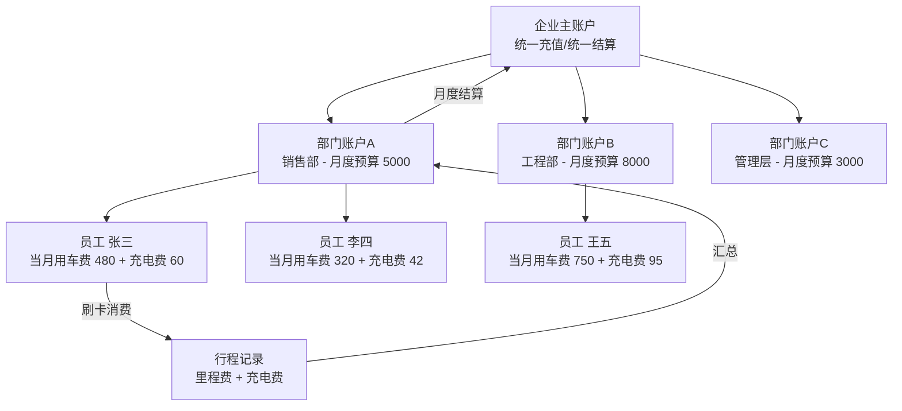

**软著申请方向：**《智御企业级车辆智能租赁与全生命周期管理系统 V1.0》

---

### 突破三：AI 全生命周期车辆管养（纯电动专项）

#### 整体数据流

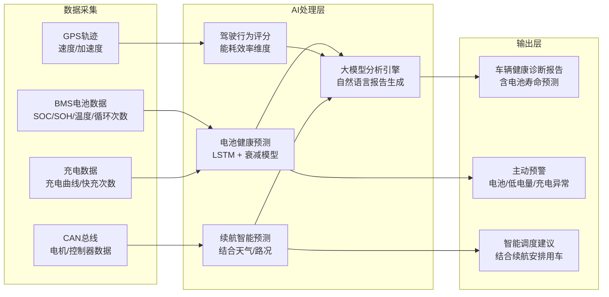

#### 纯电动专项预测维保

**电池健康度（SOH）预测模型：**

```
输入特征：
- 累计循环次数、快充占比、平均充放电深度（DOD）
- 历史充电曲线斜率（CC/CV 阶段变化率）
- 极端温度下充电次数（<0°C 或 >40°C）
- 当前 SOH 趋势（近 90 天衰减速率）

输出：
- 预测剩余健康寿命（RUL，单位：月）
- 建议换电/维保时间点
- 是否存在单体电池异常（热失控早期预警）

预警分级：
- SOH > 90%：正常，绿色
- SOH 80%-90%：关注，黄色，推送月报提醒
- SOH 70%-80%：预警，橙色，建议专项检测
- SOH < 70%：告警，红色，建议更换电池包
```

#### AI 诊断报告示例

```
【智御·智能车况报告】第 8 号车 本月健康诊断

综合评分：78分 ⚠️ 需关注

📌 电池健康：
当前 SOH 为 82%，本月衰减 0.3%，快充使用频率偏高（本月快充
14 次，建议控制在 8 次以内）。按当前趋势，预计 7 个月后需要
进行电池包专项检测，建议提前安排。

📌 能耗表现：
本月平均百公里能耗 16.2 kWh，高于车型基准（14.5 kWh）11.7%。
主要原因为急加速频率偏高（32次），建议提醒驾驶员平顺驾驶，
可延长续航约 15 公里/次。

📌 充电行为：
发现 3 次未将电量充至 80% 以上即出车，存在续航焦虑风险。
建议要求驾驶员出车前确认 SOC ≥ 80%。

📌 下次维保：
里程保养预计 23 天后到期（剩余约 1,800 公里），建议提前预约。
```

#### 驾驶行为评分体系（纯电动能耗版）

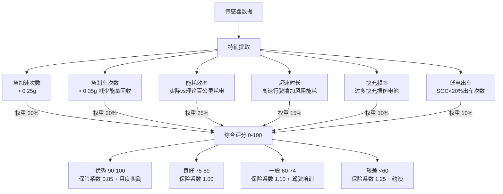

---

### 突破四：工业园区场景深度融合

#### 园区联动与充电桩一体化

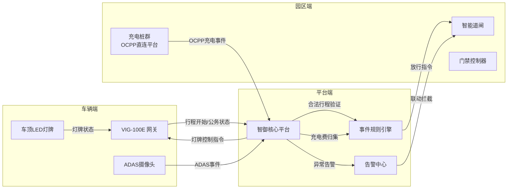

---

## 三、系统整体架构

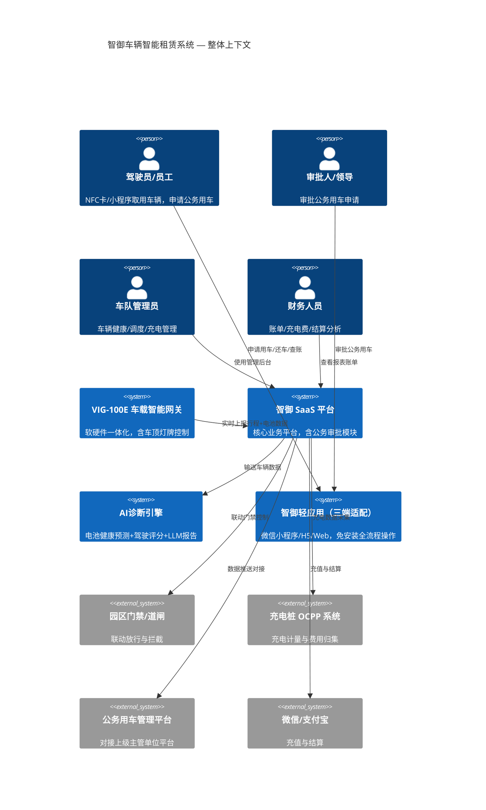

---

## 四、硬件方案详细设计

### VIG-100E 车载智能网关规格（纯电动版）

| 模块 | 选型/规格 | 说明 |
|-----|--------|-----|
| 主控芯片 | 瑞芯微 RK3308 / STM32H743 | ARM Cortex-M7，支持边缘推理 |
| 通信模块 | 移远 EC600N（4G Cat4）| MQTT / HTTPS 双协议 |
| GNSS | ublox M9N | 精度 1.5m，支持 A-GNSS |
| CAN 接口 | ISO 11898，双路 CAN 2.0B | OBD2 + BMS 私有协议 |
| NFC 模块 | NXP PN532 | ISO14443A/B，防卡复制 |
| BLE 模块 | Nordic nRF52840 | 蓝牙 5.0 钥匙 |
| 车顶灯牌 | LED 点阵驱动板，RS-232 控制 | 显示"公务用车"等字样 |
| 充电校验 | BMS SOC 曲线采集 | 与桩侧 OCPP 计量交叉校验；桩直连平台，车端不跑 OCPP |
| 本地存储 | eMMC 16GB + FRAM 256KB | 行程离线缓存+掉电保持 |
| 继电器输出 | 4 路 30A/12V | 控制点火/ACC/灯牌电源 |
| 防护等级 | IP67 | 适应车内各安装位置 |
| 供电 | 宽压 9-48V DC | 兼容全系纯电车型 |

### 多因子控车时序

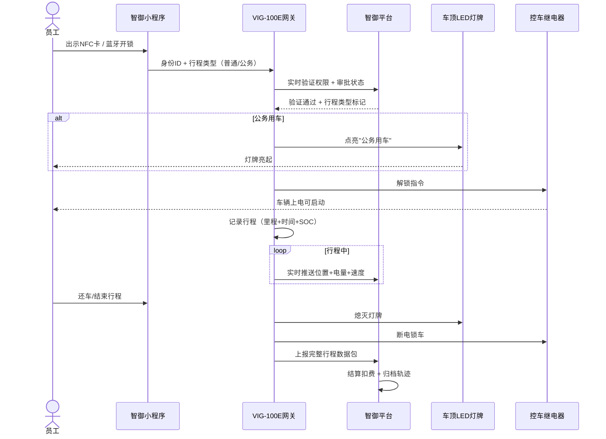

---

## 五、软件平台详细设计

### 核心数据库模型

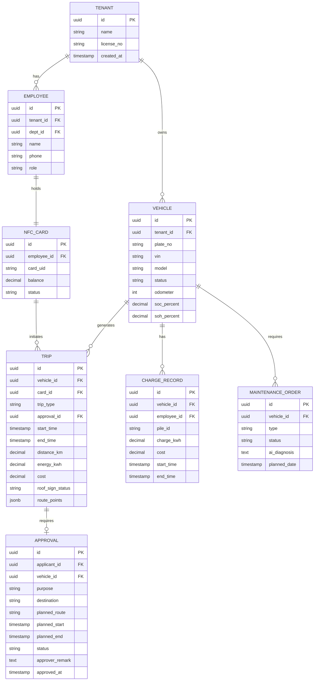

### 技术栈

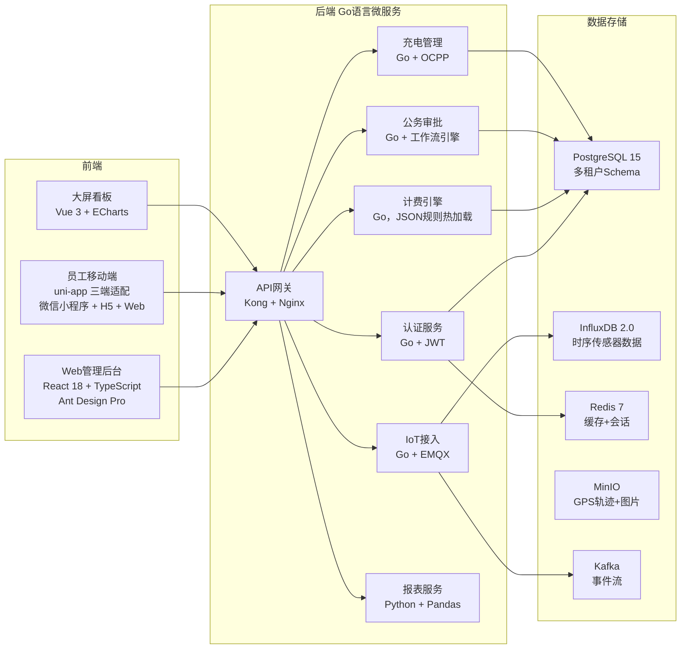

---

## 六、数据与 AI 层设计

### 数据管道架构

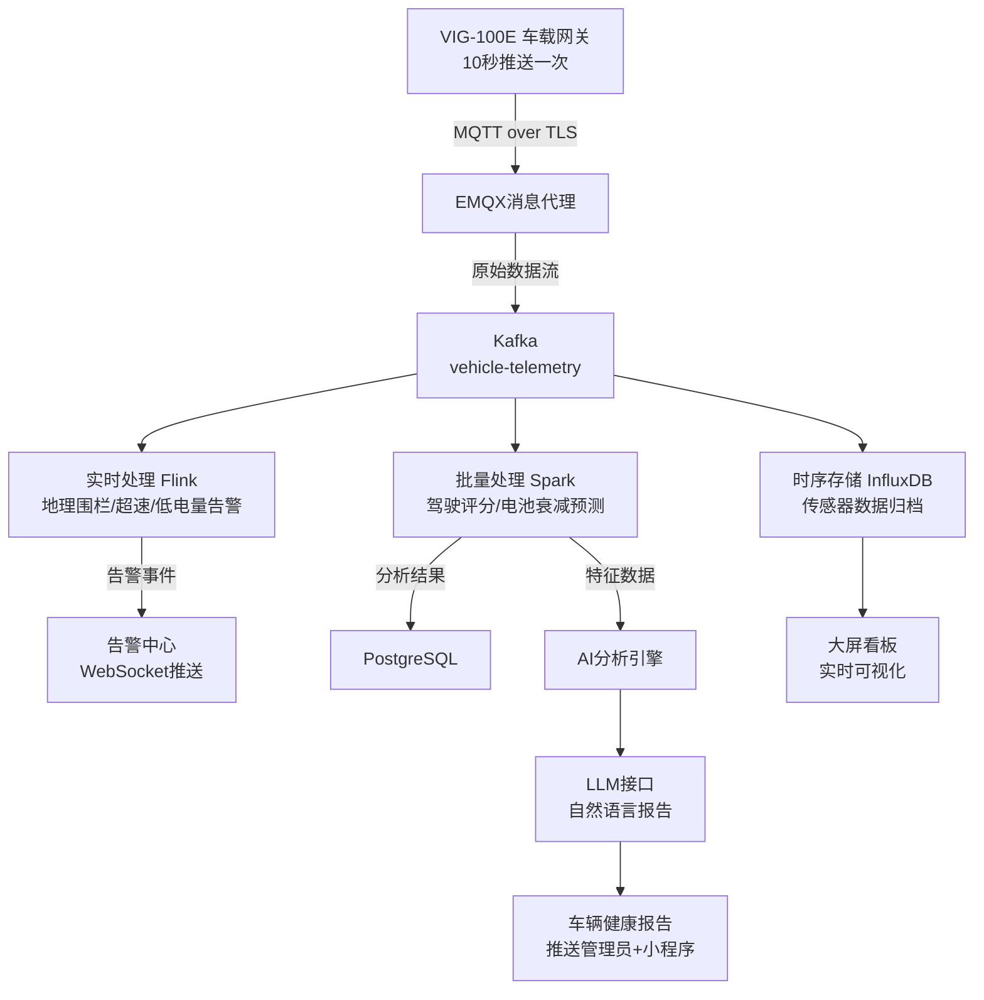

### AI 模型部署

| 模型 | 用途 | 部署 | 更新 |
|-----|-----|-----|-----|
| LSTM Autoencoder | 电池异常/故障检测 | 自部署 TF Serving | 每月重训 |
| 电池 SOH 衰减模型 | 电池寿命预测 | 自部署 Python | 每季度更新 |
| 续航预测模型 | 结合天气/路况估算续航 | 自部署 XGBoost | 每周更新 |
| 驾驶行为分类器 | 驾驶评分 | 自部署 scikit-learn | 每季度重训 |
| 大模型报告生成 | 自然语言车况报告 | API 调用（Qwen/Claude）| 实时 |

---

## 七、公务用车管理与审批平台

### 概述

本章为**智御系统**核心特色章节。针对企事业单位、机关单位公务用车的合规要求，构建完整的**线上申请—多级审批—实时调度—行程监控—费用结算—数据留痕**闭环管理体系。所有公务用车行为 100% 线上操作，用车全程可查、可追溯、可审计。

---

### 7.1 公务用车审批流程

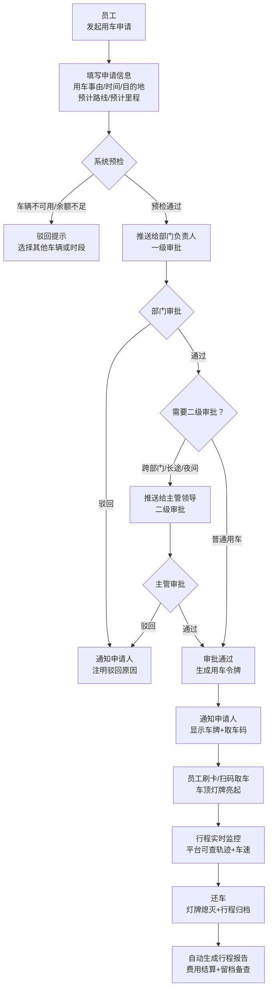

---

### 7.2 用车申请信息规范

员工通过微信小程序或 Web 端提交申请，必填项如下：

| 字段 | 类型 | 说明 | 是否必填 |
|-----|-----|-----|--------|
| 用车事由 | 枚举+自填 | 公务出行/客户拜访/政府对接/会议出席/其他 | ✅ |
| 用车时间（起）| 日期时间 | 精确到分钟 | ✅ |
| 预计还车时间 | 日期时间 | 系统自动设置超时提醒 | ✅ |
| 目的地 | 地图选点 | 在地图上标注，系统自动计算预计里程 | ✅ |
| 预计路线 | 导航路线 | 系统调用地图 API 生成推荐路线，可手动调整 | ✅ |
| 随行人员 | 多选员工 | 系统记录车内人员 | ⬜ |
| 审批附件 | 文件/图片 | 会议通知、任务单等佐证材料 | ⬜ |
| 备注 | 文本 | 特殊说明 | ⬜ |

---

### 7.3 与现有公务用车管理平台对接

智御系统提供标准化对接接口，支持接入上级主管部门或集团公务用车管理平台，实现数据互通与统一监管。

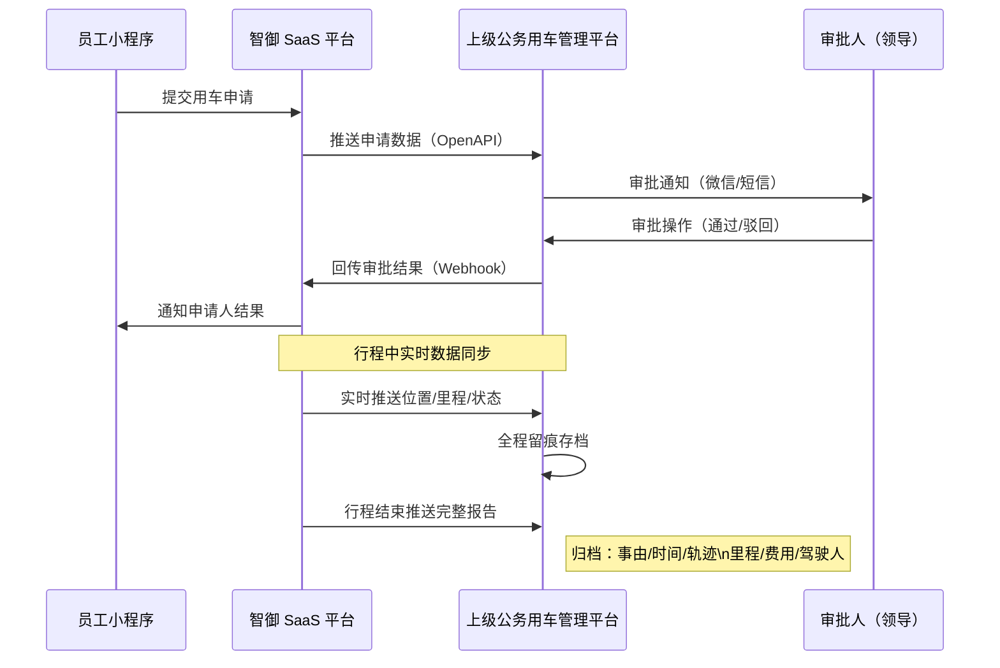

#### 对接技术规范

| 对接项 | 技术方案 | 说明 |
|-------|--------|-----|
| 申请数据推送 | REST API（JSON/HTTPS）| 实时推送，含申请全量字段 |
| 审批结果回传 | Webhook 回调 | 支持重试机制，保障可靠性 |
| 实时轨迹共享 | WebSocket 或 SSE | 行程中每 30 秒推送一次位置 |
| 行程报告归档 | 结构化 JSON + 轨迹附件 | 含行程截图地图，PDF 可导出 |
| 身份认证 | OAuth2 Client Credentials | 平台间机器互信 |
| 数据格式 | 国家/行业标准（可配置）| 支持适配不同平台数据格式 |

---

### 7.4 实时行程监控

公务行程中，管理员在平台可实时查看：

```
监控大屏信息：
┌─────────────────────────────────────────────────┐
│  车牌：粤B-12345  驾驶人：张三  审批人：李主任    │
│  用车事由：赴市局参加项目汇报                      │
│  出发时间：09:05  预计返回：12:00                  │
│  当前位置：中山路与人民路交叉口（实时更新）          │
│  当前速度：47 km/h  已行驶：23.6 km               │
│  电量：74% SOC  预计剩余续航：185 km              │
│  车顶灯牌：✅ 亮起"公务用车"                   │
│  轨迹：[地图可视化，蓝色线路显示实际行驶轨迹]        │
│  偏离预定路线：否                                  │
└─────────────────────────────────────────────────┘
```

**异常事件自动触发：**

| 异常类型 | 触发条件 | 系统动作 |
|---------|--------|--------|
| 路线偏离 | 实际轨迹偏离审批路线 > 1km | 推送告警至审批人 + 管理员 |
| 超时未还 | 超过预计还车时间 30 分钟 | 推送提醒，15 分钟后升级告警 |
| 超速行驶 | 速度超过限速 20% | 实时告警 + 记录违规事件 |
| 深夜用车 | 23:00 后仍在行驶（非审批时段）| 推送领导告警 |
| 低电预警 | SOC < 20% | 推送驾驶员 + 管理员 |
| 灯牌异常 | 公务行程中灯牌未亮 | 平台自动重发指令并告警 |

---

### 7.5 费用结算与报表留痕

行程结束后，系统自动生成**公务行程结算单**，作为费用报销与审计依据：

```
【智御公务用车行程结算单】

申请单号：ZY-2025-0618-0023
━━━━━━━━━━━━━━━━━━━━━━━
用车人：张三（销售部）       车牌：粤B-12345
审批人：李主任（部门经理）    审批时间：2025-06-18 08:52
━━━━━━━━━━━━━━━━━━━━━━━
用车事由：赴市局参加项目汇报
计划路线：公司 → 市政府 → 返回公司
实际轨迹：[附地图截图]
━━━━━━━━━━━━━━━━━━━━━━━
出发时间：2025-06-18 09:05:23
返回时间：2025-06-18 11:48:37
行驶时长：2 小时 43 分
行驶里程：47.3 km（与申请计划 45 km 偏差 +5%，正常）
消耗电量：6.8 kWh
━━━━━━━━━━━━━━━━━━━━━━━
费用明细：
  里程费：47.3 km × ¥0.60 = ¥28.38
  时长费：2.72h × ¥5.00 = ¥13.60
  电费：6.8 kWh × ¥0.65 = ¥4.42
  合计：¥46.40（自动从销售部账户扣除）
━━━━━━━━━━━━━━━━━━━━━━━
违规记录：无
车顶灯牌：全程亮起 ✅
数据来源：系统自动生成，不可篡改
```

---

## 八、轻应用平台设计（三端适配，不单独开发 App）

### 8.1 整体功能架构

智御移动端采用 **uni-app 三端适配技术**——一套代码同时编译为**微信小程序、H5、Web 管理端**，**不单独开发原生 App**：

- 员工端以微信小程序为主入口，免下载安装、即用即走，天然打通微信消息通知与微信支付充值；
- H5 端嵌入企业微信/钉钉工作台，审批通知直达、点开即批，审批人无需切换应用；
- Web 端面向管理员与财务，承载管理后台与报表大屏；
- 版本更新无需应用商店审核，发布周期从数天缩短至分钟级，显著降低开发与运维成本。

员工版与管理版共用一套代码，按账号权限自动切换视图。

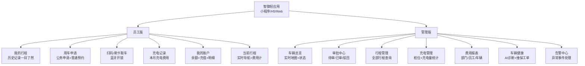

---

### 8.2 员工端核心页面

#### 首页（员工视角）

```
┌──────────────────────────────┐
│ 智御出行          张三 ▼      │
│─────────────────────────────│
│ 👋 早上好，张三               │
│ 账户余额  ¥ 386.50  [充值]   │
│─────────────────────────────│
│ [📋 申请用车]  [🔑 扫码取车]  │
│─────────────────────────────│
│ 本月用车概览                  │
│ 行程次数：8次  累计里程：234km │
│ 用车费用：¥140  充电费：¥28   │
│─────────────────────────────│
│ 最近行程                      │
│ ▶ 06/18 赴市局 47.3km ¥46.4  │
│ ▶ 06/15 客户拜访 32.1km ¥31  │
│ ▶ 06/12 会议出席 18.6km ¥18  │
│  [查看全部行程] ──────────>   │
└──────────────────────────────┘
```

#### 发起用车申请页面

```
┌──────────────────────────────┐
│ ← 申请用车                    │
│─────────────────────────────│
│ 用车类型  ○公务用车  ◉日常用车  │
│─────────────────────────────│
│ 用车事由  [公务出行        ▼] │
│ 具体说明  [赴市局参加项目汇报  ]│
│─────────────────────────────│
│ 取车时间  06/19  09:00       │
│ 还车时间  06/19  12:30       │
│─────────────────────────────│
│ 目的地    [在地图上选择     📍]│
│           市政府大楼          │
│ 推荐路线  [预计 45km，约55分] │
│           [查看路线地图]       │
│─────────────────────────────│
│ 审批人    李主任（自动匹配）   │
│─────────────────────────────│
│ 上传附件  [+ 添加会议通知截图] │
│─────────────────────────────│
│       [提交申请]              │
└──────────────────────────────┘
```

#### 行程详情页（全部信息一目了然）

```
┌──────────────────────────────┐
│ ← 行程详情                    │
│─────────────────────────────│
│ 🗓 2025-06-18  公务用车 ✅    │
│─────────────────────────────│
│ ⏱ 时间轴                     │
│ 09:05  出发（公司园区B栋）    │
│ 09:52  抵达目的地（市政府）   │
│ 11:31  离开目的地             │
│ 11:48  返回（公司园区B栋）    │
│─────────────────────────────│
│ 📍 轨迹地图  [蓝色行驶路线]   │
│─────────────────────────────│
│ 📊 行程数据                   │
│ 总里程    47.3 km            │
│ 行驶时长  2小时 43分          │
│ 平均速度  42 km/h            │
│ 最高速度  78 km/h            │
│ 消耗电量  6.8 kWh            │
│ 百公里耗电 14.4 kWh（良好）   │
│─────────────────────────────│
│ 💰 费用明细                   │
│ 里程费    ¥28.38             │
│ 时长费    ¥13.60             │
│ 电费      ¥4.42             │
│ ─────────────────           │
│ 合计      ¥46.40            │
│─────────────────────────────│
│ 🚘 车辆     粤B-12345         │
│ 驾驶员     张三               │
│ 审批人     李主任             │
│─────────────────────────────│
│  [导出PDF]      [申诉行程]    │
└──────────────────────────────┘
```

---

### 8.3 管理端核心页面

#### 车辆总览（管理员首页）

```
┌──────────────────────────────┐
│ 智御管理          李主任 ▼    │
│─────────────────────────────│
│ 今日概览   2025-06-18        │
│ 在途车辆  7辆  空闲车辆  11辆 │
│ 充电中    2辆  维保中    0辆  │
│─────────────────────────────│
│ [实时地图]                    │
│ ●在途 ●充电 ●空闲 ●维保       │
│ ┌──────────────────────────┐ │
│ │                  •粤B123  │ │
│ │    •粤B456              │ │
│ │         •粤B789          │ │
│ └──────────────────────────┘ │
│─────────────────────────────│
│ 待审批用车申请  3 条 [处理]   │
│─────────────────────────────│
│ 告警  1 条                   │
│ ⚠️ 8号车续航低于20%          │
└──────────────────────────────┘
```

#### 行程管理页（筛选查询）

```
┌──────────────────────────────┐
│ ← 行程管理                    │
│─────────────────────────────│
│ 🔍 [搜索车牌/姓名/事由]       │
│─────────────────────────────│
│ 筛选：[日期范围] [部门▼] [类型▼]│
│─────────────────────────────│
│ 今日行程（共 12 条）           │
│─────────────────────────────│
│ 粤B-12345  张三  公务 ✅      │
│ 09:05→11:48  47.3km  ¥46.4  │
│ 赴市局项目汇报  [查看轨迹]    │
│─────────────────────────────│
│ 粤B-67890  王五  日常         │
│ 08:30→10:15  23.6km  ¥22.8  │
│ 物料采购         [查看轨迹]   │
│─────────────────────────────│
│ 数据汇总                      │
│ 今日总里程  342.7 km          │
│ 今日总费用  ¥ 328.50          │
│ 今日总耗电  49.2 kWh          │
│─────────────────────────────│
│ [导出Excel]   [导出PDF报告]   │
└──────────────────────────────┘
```

#### 费用报表页

```
┌──────────────────────────────┐
│ ← 费用报表   [月] [季] [年]   │
│─────────────────────────────│
│ 本月汇总（2025年6月）         │
│─────────────────────────────│
│ 柱状图：各部门费用对比        │
│ ████████ 销售部  ¥2,340      │
│ ██████   工程部  ¥1,860      │
│ ████     行政部  ¥1,020      │
│─────────────────────────────│
│ 折线图：每日里程趋势          │
│─────────────────────────────│
│ 部门明细                      │
│ 部门    里程      费用   环比  │
│ 销售部  1,234km  ¥2,340  +5% │
│ 工程部  986km    ¥1,860  -2% │
│ 行政部  534km    ¥1,020  +1% │
│─────────────────────────────│
│ 员工排行（费用 TOP 5）        │
│ 1. 张三  ¥480  23次  312km   │
│ 2. 王五  ¥420  18次  267km   │
│─────────────────────────────│
│ [导出Excel] [推送月报至领导]  │
└──────────────────────────────┘
```

---

### 8.4 三端适配技术实现

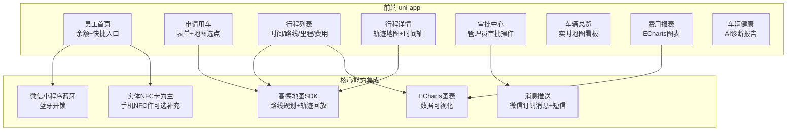

**三端分工：**

| 端 | 载体 | 面向用户 | 定位 |
|---|-----|--------|-----|
| 微信小程序 | 微信生态 | 员工 | 取还车、用车申请、查账主入口，支持小程序蓝牙钥匙 |
| H5 | 企业微信/钉钉/浏览器 | 员工+审批人 | 审批通知直达，点开即批 |
| Web | PC 浏览器 | 管理员/财务 | 管理后台、费用报表、大屏看板 |

> 注：微信小程序对手机系统级 NFC 的支持有限（仅部分 Android HCE 场景），控车身份识别以**实体 NFC 卡 + 小程序蓝牙钥匙**为主，手机 NFC 作为可选补充能力。

**轻应用核心交互设计原则：**

- 取车操作不超过 **2 步**（首页点取车 → 刷卡/扫码 → 完成）
- 申请用车不超过 **3 步**（填写事由+时间+目的地 → 提交 → 等待审批）
- 行程数据在列表中直接可见时间、里程、费用，无需点击进详情
- 支持**轨迹回放**：任意历史行程可在地图上按时间轴回放行驶路线
- 离线缓存本地行程数据，网络恢复后自动同步

---

## 九、安全与合规设计

### 安全架构

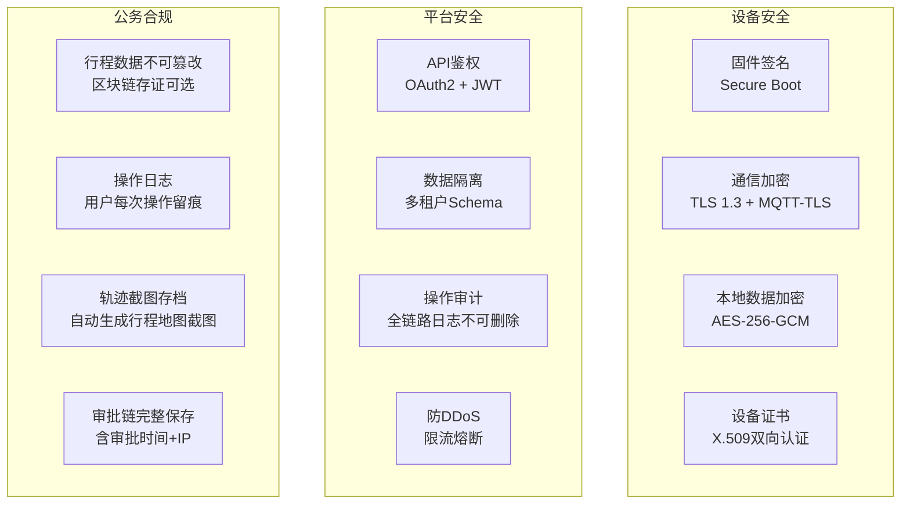

### 纯电动特有安全措施

- **电池热失控预警**：BMS 温度异常立即推送告警，支持远程断电保护
- **低电锁定**：SOC < 10% 时，系统限制新行程启动，强制要求充电后方可取车
- **充电安全**：异常充电电流/电压自动断桩告警
- **夜间充电管理**：深夜快充自动切换慢充模式，保护电池健康

---

## 十、知识产权保护策略

### 专利布局

| 序号 | 类型 | 名称 | 时间 | 核心要点 |
|-----|-----|-----|-----|--------|
| 1 | 发明专利 | 一种工业园区离线状态下纯电动车辆安全控车与计费的物联网系统及方法 | 第一阶段末 | 边缘计算离线计费 |
| 2 | 实用新型 | 一种集成多因子身份认证与公务状态显示的车载智能网关装置 | 第一阶段末 | VIG-100E 硬件+灯牌 |
| 3 | 发明专利 | 一种基于驾驶行为和电池健康数据的车辆租赁动态定价方法 | 第二阶段末 | AI评分影响租金 |
| 4 | 发明专利 | 一种公务用车全流程线上审批与轨迹留痕的智能管理方法 | 第二阶段 | 公务审批+灯牌联动 |
| 5 | 软件著作权 | 智御车辆智能租赁与全生命周期管理系统 V1.0 | 第二阶段 | 平台整体软件 |

---

## 十一、实施路线图

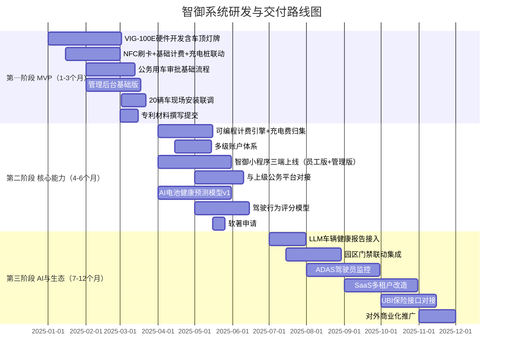

### 投入与效益估算

| 阶段 | 周期 | 核心交付 | 硬件投入 | 软件投入 | 预期效益 |
|-----|-----|--------|--------|--------|--------|
| 第一阶段 | 1-3月 | VIG硬件+灯牌+基础计费+公务审批 | 20台×3500=7万 | 18万 | 合规用车，0违规 |
| 第二阶段 | 4-6月 | 计费引擎+AI维保+小程序三端+平台对接 | 0 | 20万 | 维保成本降20%，免原生App开发节省约2万 |
| 第三阶段 | 7-12月 | AI报告+园区联动+SaaS化 | 2万 | 30万 | 对外销售年收50万+ |
| **合计** | **12月** | **完整SaaS产品** | **9万** | **68万** | **ROI 3年回正** |

---

## 十二、技术选型汇总

### 后端服务

| 服务 | 技术 | 理由 |
|-----|-----|-----|
| API 服务 | Go 1.22 + Gin | 高并发，适合 IoT 场景 |
| 计费引擎 | Go + GJSON | 规则 JSON 热加载，零停机更新 |
| 工作流引擎 | Go + Camunda BPM | 支持公务审批复杂流程 |
| 数据分析 | Python 3.11 + FastAPI | 丰富 ML 生态 |
| 消息队列 | Kafka 3.x | 高吞吐，行程数据回放 |
| IoT 接入 | EMQX 5.x | 百万并发连接，MQTT 5.0 |
| 充电桩协议 | OCPP 1.6/2.0（桩直连平台，平台作CSMS服务端）| 国际通用，兼容主流桩厂，桩侧零改造 |

### 前端与移动端

| 端 | 技术 | 理由 |
|---|-----|-----|
| Web 后台 | React 18 + Ant Design Pro | 企业级 UI，开发效率高 |
| 移动端 | uni-app 三端适配 | 一套代码编译微信小程序/H5/Web，不单独开发原生 App |
| 大屏看板 | Vue 3 + ECharts 5 | 可视化组件丰富 |
| 地图服务 | 高德地图 SDK | 国内路网准确，支持轨迹回放 |

### 基础设施

| 组件 | 选型 | 部署方式 |
|-----|-----|--------|
| 容器编排 | K3s（轻量 K8s）| 初期单机，后期集群 |
| 主数据库 | PostgreSQL 15 | 阿里云 RDS，托管省运维 |
| 时序数据库 | InfluxDB 2.0 | 自部署，数据主权 |
| 对象存储 | 阿里云 OSS | GPS 轨迹/行程截图 |
| 区块链存证 | 蚂蚁链（可选）| 公务行程数据不可篡改 |

---

## 附录：核心竞争力总结

```
智御系统护城河体系

技术壁垒（专利保护）
├── 离线边缘计费算法（发明专利）
├── 公务灯牌+多因子控车一体化（实用新型）
├── 电池健康+驾驶评分动态定价（发明专利）
└── 公务审批轨迹留痕方法（发明专利）

数据壁垒（越用越强）
├── 纯电车型电池衰减预测模型（场景稀缺）
├── 工业园区行驶行为基准数据
└── 企业公务出行路线数据库

生态壁垒（切换成本高）
├── 与上级公务平台深度对接（行政依赖）
├── 与园区门禁/充电桩深度集成
└── 员工微信小程序使用习惯形成（微信生态内即用即走，迁移阻力大）

合规壁垒（政策红利）
├── 公务用车全程留痕，满足审计要求
├── 灯牌标识，满足公务用车可识别要求
└── 电子存证，可对接纪检/审计系统
```

---

*文档名称：智御车辆智能租赁与全生命周期管理系统 V1.1 技术方案*
*版本：v1.1（修订：T-BOX成熟路线对标自研 / 桩直连平台充电架构 / 三端适配免App）| 机密等级：内部使用 | 禁止外传*
